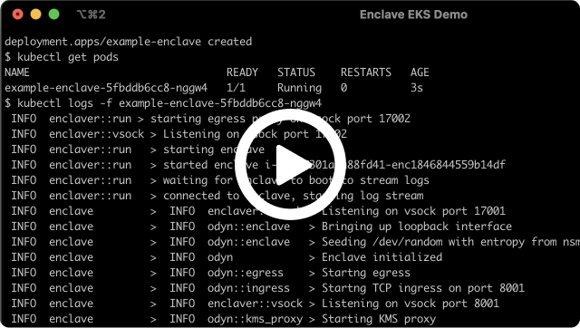

# Deploy on Kubernetes running on AWS

Enclaver can be used with Kubernetes to run Nitro Enclaves on qualified Nodes in your EKS, Rancher/k3s or OpenShift cluster. Users of your cluster can use an enclave image (from `enclaver build`) inside of a Deployment.

[](https://www.youtube.com/watch?v=Alte0y52WEY)

## Running an Enclave

Running an Deployment that uses an enclave is very easy since Enclaver images are self-contained. They can be scaled out normally based on your Node availability.

<details>
  <summary>View example-enclave.yaml</summary>

```yaml
apiVersion: apps/v1
kind: Deployment
metadata:
  name: example-enclave
  namespace: default
spec:
  replicas: 1
  selector:
    matchLabels:
      app: example
  template:
    metadata:
      labels:
        app: example
    spec:
      topologySpreadConstraints:
      - maxSkew: 1
        topologyKey: kubernetes.io/hostname
        whenUnsatisfiable: DoNotSchedule
      nodeSelector:
        enclaver.io/enclave: nitro
      containers:
      - name: enclave
        image: registry.edgebit.io/no-fly-list:enclave-latest
        ports:
           - containerPort: 8001
             name: enclave-app
        volumeMounts:
        - mountPath: /dev/nitro_enclaves
          name: nitro-enclaves
        - mountPath: /dev/hugepages-1Gi
          name: hugepages
          readOnly: false
        securityContext:
          privileged: true
        resources:
          limits:
            hugepages-1Gi: 3Gi
            memory: 500Mi
          requests:
            hugepages-1Gi: 3Gi
      restartPolicy: Always
      volumes:
      - name: nitro-enclaves
        hostPath:
          path: /dev/nitro_enclaves
      - name: hugepages
        emptyDir:
          medium: HugePages
```
</details>

There are a few essential parts of each Deployment:
1. The `nodeSelector` is selecting only our Nitro enabled Nodes and the `topologySpreadConstraints` ensures that each Node only runs one enclave at a time.
2. The `image` of the enclave container points to your enclave image.
3. The resource limit for `hugepages-1Gi` should match or exceed the memory value from your `enclaver.yaml`. In our example above, it's 3 GB.
4. The pod must run as privileged to mount `/dev/nitro_enclaves`

## Add Qualified Nodes to your EKS Cluster

This guide assumes you already have an EKS cluster. It doesn't matter if it has other NodeGroups attached to it.

Only certain [EC2 instance types][instance-req] can run Nitro Enclaves. `c6a.xlarge` is the cheapest qualifying instance type as of this writing) and Docker installed.  See [the Deploying on AWS](deploy-aws.md) for more details. Create the CloudFormation stack before continuing:

[][cloudformation-x86]

It will create a Launch Template in order to set enclave options, create an IAM role for our Nodes to talk to the cluster, then create an EKS NodeGroup that references both.

Due to Amazon restrictions, each EC2 machine can only run a single enclave at a time. This is enforced by `topologySpreadConstraints` in the Deployment.

[instance-req]: https://docs.aws.amazon.com/enclaves/latest/user/nitro-enclave.html#nitro-enclave-reqs
[cloudformation-x86]: https://us-east-1.console.aws.amazon.com/cloudformation/home?region=us-east-1#/stacks/create/review?templateURL=https://enclaver-cloudformation.s3.amazonaws.com/enclaver-eks-nodegroup-x86.yaml&stackName=Enclaver-Demo

### Labeling Nodes

The CloudFormation will label your Nodes with `enclaver.io/enclave=nitro` so that your Deployment can target the qualified Nodes.

```console
$ kubectl get nodes --selector=enclaver.io/enclave=nitro
NAME                            STATUS   ROLES    AGE     VERSION
ip-172-31-37-102.ec2.internal   Ready    <none>   5m      v1.23.9-eks-ba74326
ip-172-31-38-217.ec2.internal   Ready    <none>   4m44s   v1.23.9-eks-ba74326
```

### Tainting is Optional

You may also Taint your Nodes so other workloads don't land on it, but in most cases we don't think that is useful. Enclaves work well when deployed like a sidecar, either directly in a Pod or with affinity to another Deployment. The larger instances are also more expensive, so you'll probably want to use those resources to run other Pods unless your security posture won't allow it.

## Testing the Enclave

Submit the sample enclave application to the cluster ([download here][k8s-deployment]):

```console
$ kubectl create -f example-enclave.yaml
```

The example app answers web requests on port 8001. You can make a Service and Load Balancer to address all of the Pods, or for a simple test, port-forward to the Pod:

```console
$ kubectl port-forward <podname> 8001:8001
```

Then send a request to the forward port, which will be answered from within the enclave:

```console
$ curl localhost:8001
"https://enclaver.io/docs/0.x/guide-app/"
```

Jump over to the [simple Python app][app] guide (the URL printed above) that explains our sample application in more detail.

[app]: guide-app.md
[k8s-deployment]: https://github.com/enclaver-io/enclaver/blob/main/docs/assets/example-enclave.yaml

## Troubleshooting

If your pods are pending, check that hugepages is enabled on your Nodes. Here's what the status block of a pending Node looks like:

```console
$ kubectl get pods/example-enclave-5fbddb6cc8-nspgw -o yaml
...
status:
  conditions:
  - lastProbeTime: null
    lastTransitionTime: "2022-11-08T14:35:27Z"
    message: '0/2 nodes are available: 2 Insufficient hugepages-1Gi.'
    reason: Unschedulable
    status: "False"
    type: PodScheduled
  phase: Pending
  qosClass: Burstable
```

Check that Kubernetes is reading the available hugepages by looking at one of your Nitro Enclave Nodes. Here you can see that `hugepages-1Gi` has capacity for `3Gi`. If your Node is not configured correctly, you might see a `0` for both hugepages entries.

```console
$ kubectl get nodes/ip-172-31-37-102.ec2.internal -o yaml
...
  allocatable:
    attachable-volumes-aws-ebs: "39"
    cpu: 1930m
    ephemeral-storage: "18242267924"
    hugepages-1Gi: 3Gi
    hugepages-2Mi: "0"
    memory: 3796024Ki
    pods: "58"
  capacity:
    attachable-volumes-aws-ebs: "39"
    cpu: "2"
    ephemeral-storage: 20959212Ki
    hugepages-1Gi: 3Gi
    hugepages-2Mi: "0"
    memory: 7958584Ki
    pods: "58"
...
```
